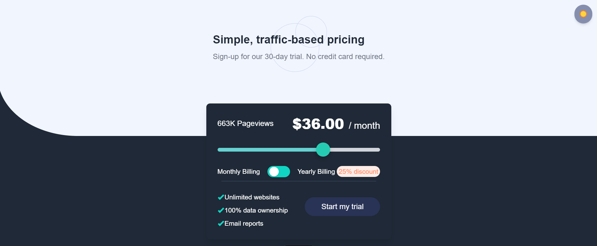

# Invsto Assignment

A web application built with the latest web technologies to manage and display financial data efficiently. This project demonstrates the use of modern frameworks and tools for scalable and maintainable web development.
  
## Table of Contents

- [Overview](#overview)
- [Features](#features)
- [Technologies Used](#technologies-used)
- [Installation](#installation)
- [Usage](#usage)
- [Deployment](#deployment)
- [Contributing](#contributing)
- [License](#license)
## Output




## Overview

This project was developed as part of an assignment to showcase expertise in frontend  development.

## Features

- User-friendly interface with interactive sliders and data visualization.
- Responsive design for seamless use on all devices.
- Follows best practices in code structure and design patterns.

## Technologies Used

- **Frontend**: React.js, Next.js, Tailwind CSS
- **Database**: MongoDB (if applicable)
- **Other Tools**:
  - Vercel (for deployment)

## Installation

1. Clone the repository:
   ```bash
   git clone https://github.com/crazyay/Invsto_Assignment.git
